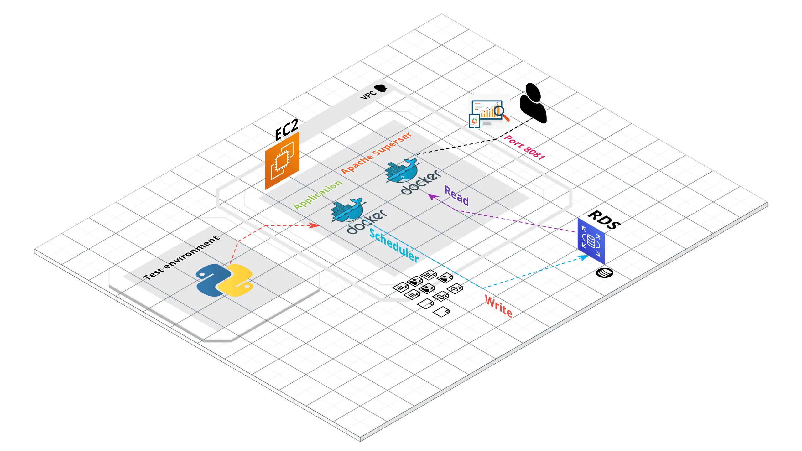

# Crawl-InstantGaming

## Introduction 

This repository, launched in 2024, intends to crawl data from [instant-gaming](https://www.instant-gaming.com/en/). 

## Usage

## Suggesting projects

- [ ] Game Classification via Description. 
- [ ] Game Searching via Description. 

## Reference

1. https://medium.com/kariyertech/web-crawling-general-perspective-713971e9c659
2. https://medium.com/kariyertech/web-crawling-general-perspective-713971e9c659 